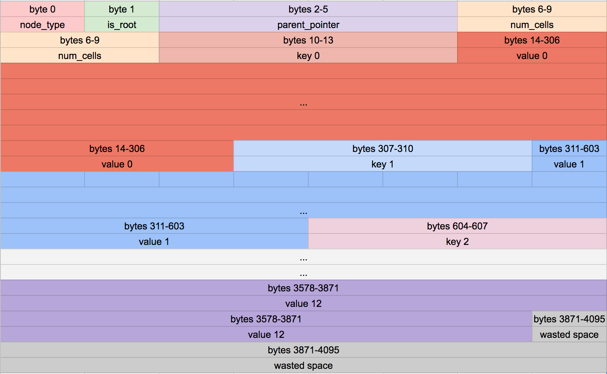
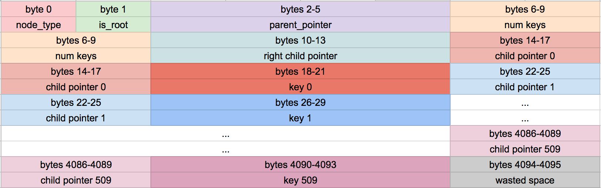

# B+ tree

叶子节点：

内部节点：

## references

- [Let's Build a Simple Database](https://cstack.github.io/db_tutorial/parts/part8.html)
- https://zh.wikipedia.org/wiki/B%2B%E6%A0%91
- https://en.wikipedia.org/wiki/B%2B_tree
- https://github.com/xiang90/bplustree